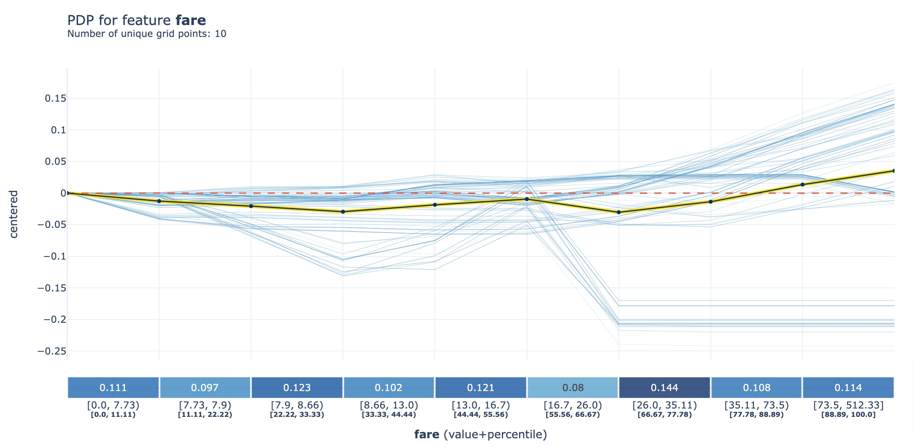
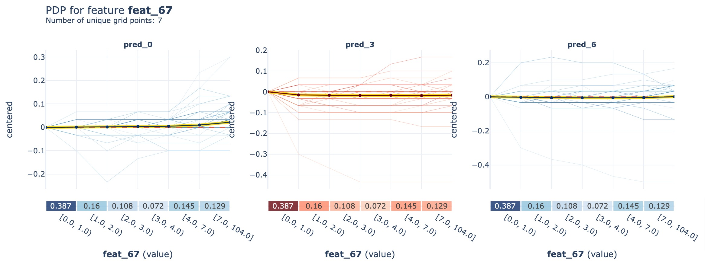
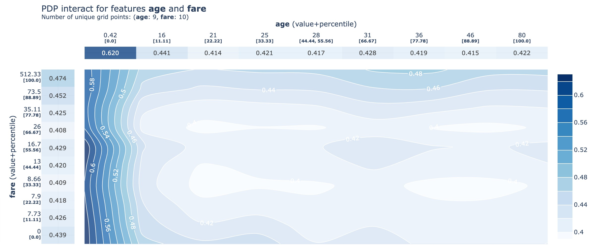
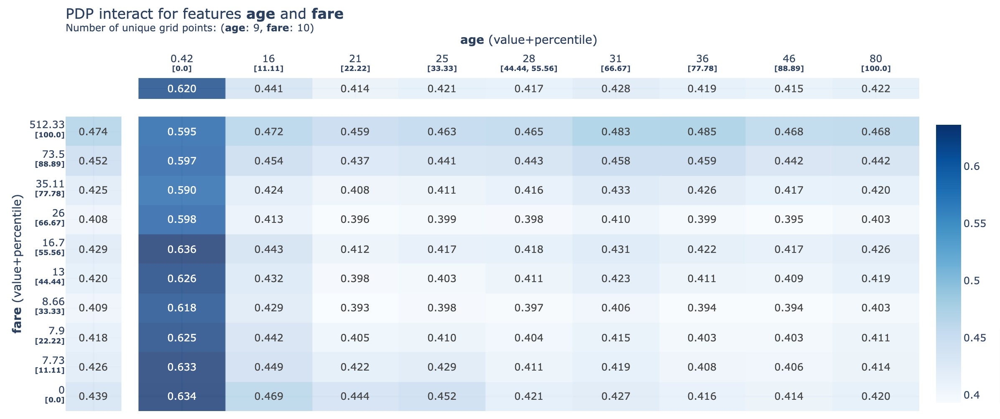
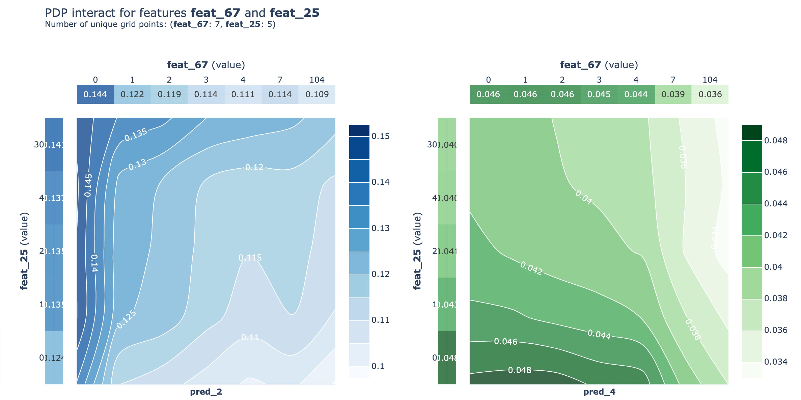
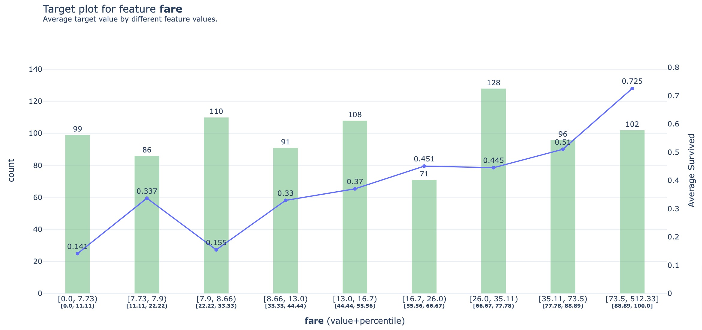
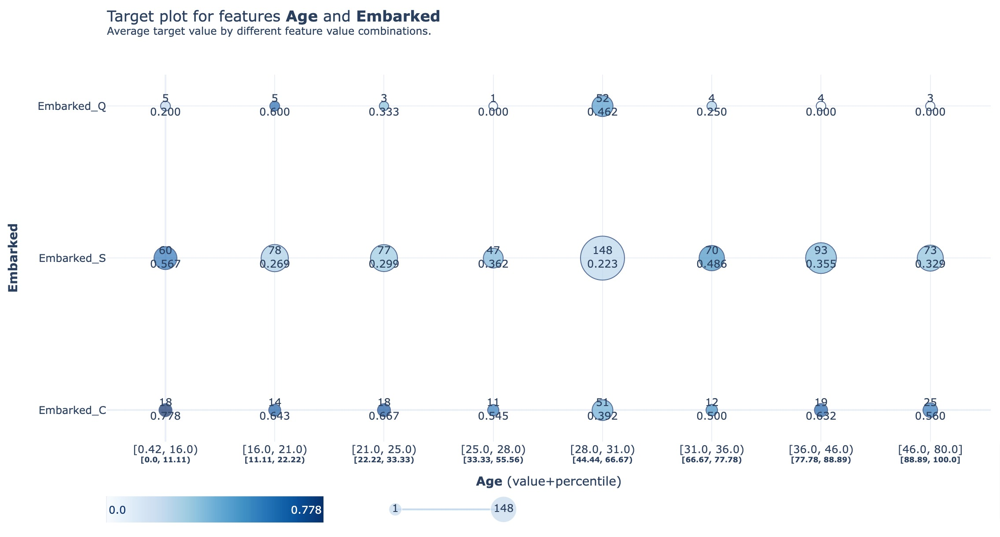
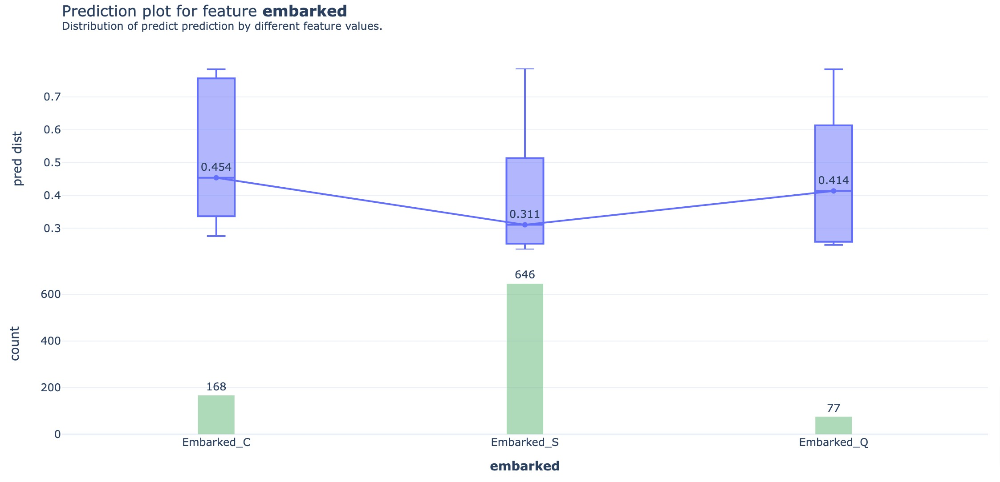

# PDPbox
[](https://badge.fury.io/py/PDPbox)
[](https://codecov.io/gh/SauceCat/PDPbox)


Python **P**artial **D**ependence **P**lot tool**box**.

Visualize the influence of certain features on model predictions for supervised machine learning algorithms, 
utilizing partial dependence plots.

For a comprehensive explanation, I recommend referring to the [Partial Dependence Plot (PDP)](https://christophm.github.io/interpretable-ml-book/pdp.html) chapter in Christoph Molnar's book, [Interpretable Machine Learning](https://christophm.github.io/interpretable-ml-book/). 

## I am back! :smirk_cat:

After four years...

I'm delighted to see how popular PDPbox has become; it has exceeded all my expectations. 
When I first embarked on this project, it was a modest endeavor, 
simply to whet my appetite for real-world Python package development.

With the shift in my career path towards deep learning in 2018, I had to halt the development and maintenance of PDPbox. 
As I no longer actively used it and several other outstanding packages such as 
[lime](https://github.com/marcotcr/lime) and [shap](https://github.com/slundberg/shap) were emerging.

However, as the years have passed, I have seen PDPbox gain a significant presence in the community. 
It's been referenced in various online courses and books, demonstrating its valuable role. 
Despite well-known limitations of partial dependence plots, 
their simplicity and intuitiveness might have made them a popular starting point for many, 
appealing to a broad range of audiences.

Given this, I feel a renewed sense of responsibility to revisit the project, refine the existing code, 
potentially add new features, and create additional tutorials. 
I'm excited about this next phase and look forward to contributing more to the open source community.

## Installation

- through pip
  ```
  $ pip install pdpbox
  ```

- through git (latest develop version)
  ```
  $ git clone https://github.com/SauceCat/PDPbox.git
  $ cd PDPbox
  $ python setup.py install
  ```

## Reference

- Documentation: http://pdpbox.readthedocs.io/en/latest/
- Tutorials: tutorials
- Change Log: CHANGELOG.md


## Testing
### Test with `pytest`

```
cd <dir>/PDPbox
python -m pytest tests
```

### Test with `tox`
PDPbox can be tested using `tox`.

- First install `tox`

  ```
  $ pip install tox
  ```
  
- Call `tox` inside the pdpbox clone directory. This will run tests with python3.9.

- To test the documentation, call `tox -e docs`. 
  The documentation should open up in your browser if it is successfully build.
  Otherwise, the problem with the documentation will be reported in the output of the command.


## Gallery
- **PDP:** PDP for a single feature

    

---

- **PDP:** PDP for a multi-class

    

---

- **PDP Interact:** PDP Interact for two features with contour plot

    

---

- **PDP Interact:** PDP Interact for two features with grid plot

    

---

- **PDP Interact:** PDP Interact for multi-class

    

---

- **Information plot:** target plot for a single feature

    

---

- **Information plot:** target interact plot for two features

    

---

- **Information plot:** prediction plot for a single feature

    
